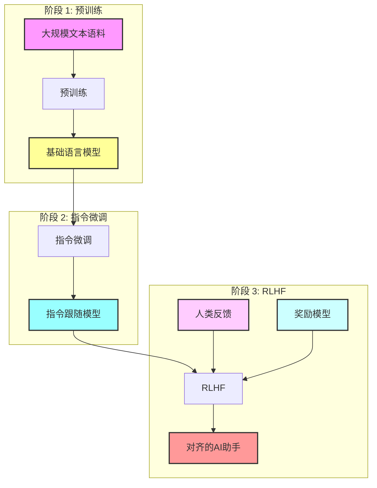

# 生成式人工智能

## 入门指南及应用

通用人工智能与数字经济创新团队，2024

<div class="flex justify-center items-center h-60px mt-8px">
    
</div>

---

# 关于我：陈中普

- <flat-color-icons-department /> 西南财经大学，计算机与人工智能学院
- <flat-color-icons-serial-tasks /> 时空数据库，大数据分析，向量数据库，大模型应用
- <flat-color-icons-address-book /> zpchen@swufe.edu.cn
- <flat-color-icons-home /> https://zhongpu.info

<v-click>

<div class="flex justify-center items-center h-300px mt-8px">
    
</div>

</v-click>

-----

# AIGC、AGI与LLM 

<div class="flex justify-center items-center h-200px mt-8px">
    
</div>

| 术语 | 全称 | 中文 |
| ---- | ---- | ---- |
| AIGC | Artificial Intelligence Generated Content | 人工智能自动生成内容 |
| AGI | Artificial General Intelligence | 通用人工智能 |
| LLM | Large Language Model | 大型语言模型 | 

其中，AIGC也被称为<span class="text-red">Generative Artificial Intelligence</span>（生成式人工智能）


-----

# 报告提纲

## <span class="text-red">一、生成式AI到底是什么？</span>
## 二、如何使用大模型？
## 三、模型、数据与算力

----

# 一、生成式AI到底是什么？

考虑一个新闻分类应用：

> 9月20日消息，晶合集成公告称，公司拟与合肥建恒新能源汽车投资基金合伙企业（有限合伙）、合肥高新建设投资集团有限公司、合肥泽柏企业管理合伙企业（有限合伙）、合肥晶汇聚芯投资基金合伙企业（有限合伙）、杰瓦特微电子（杭州）有限公司及方晶科技的员工持股平台合肥泽析企业管理咨询合伙企业（有限合伙）、合肥泽栩企业管理合伙企业（有限合伙）、合肥泽桓企业管理合伙企业（有限合伙）、合肥泽祁企业管理合伙企业（有限合伙）共同向合肥方晶科技有限公司进行增资，各增资方以1.00元/注册资本的价格合计增资29,000万元。


<div class="flex justify-center items-center h-280px mt-8px">
    
</div>

------

## ChatGPT终结了此类问题

<div class="flex justify-center items-center h-400px mt-8px">
    
</div>

---
layout: image-right
image: Hundt.jpg
---

## 大人，时代变了！


<div class="flex justify-center items-center h-200px mt-8px">
    
</div>

- 了解生成式AI的基本原理
- 理解其优势及局限
- 了解其发展趋势及应用场景

来源：https://wiktenauer.com/wiki/Michael_Hundt

---

## 生成式AI是个模型

|  $x_1$ | $x_2$ | $f(x_1, x_2)$ |
| ---- | ---- | ----------- |
|  1   |  2   |  5  |
| 2   |  3   |  13 |
| ... | ... | ... |

$$f(x_1, x_2) = x_1^2 + 5x_2 - 6$$

<v-click>

而类似ChatGPT等高级模型有<span class="text-red">千亿</span>个参数：

<div class="flex justify-center items-center h-160px mt-8px">
    
</div>

</v-click>

---
layout: image-right
image: network.png
---

### 参数（权重）示意图


$$y_j = f\left( \sum_{i=1}^{n} w_{ji} x_i + b_j \right)$$

$$\mathbf{a}^{(l)} = f\left( W^{(l)} \mathbf{a}^{(l-1)} + \mathbf{b}^{(l)} \right)$$


<div class="flex justify-center items-center h-280px mt-8px">
    
</div>

---

## 生成式AI难在哪里？

<div class="flex justify-center items-center h-300px mt-8px">
    
</div>

汉字表中3500常用汉字，7000通用汉字。写一篇800字的文章，有多少种可能？

$$N = 3500^{800}$$

<span class="text-red">而目前可观测宇宙中的原子数约为$10^{82}$。</span>

---

## 生成式AI的一种方式是文字接龙！


上述过程就是一个<span class="text-red">语言模型（Language Model）</span>。

## 生成式AI也不是今天才有的

早在2006年，就出现了谷歌翻译。

<div class="flex justify-center items-center h-200px mt-8px">
    
</div>


----

## 如今的生成式AI有什么不同？

> 语言模型的范式从”预训练-传统微调“转向”大模型-提示工程“

大型预训练模型已经学到了丰富的语言表示，因此具备强大的生成能力，能够适应多种任务。通过调整输入<span class="text-red">提示</span>，可以引导模型执行各种任务，而不需要为每个任务单独训练一个模型。

<v-click>

<div class="flex justify-center items-center h-360px mt-8px">
    
</div>

</v-click>

---

# 报告提纲

## 一、生成式AI到底是什么？
## <span class="text-red">二、如何使用大模型？</span>
## 三、模型、数据与算力

---

## 使用方式1：提示工程

模型是一个函数，它的参数是固定的，而输入是不固定的。因此，我们可以通过调整输入来引导模型执行不同的任务。这个调整的过程就是<span class="text-red">提示工程（prompt engineering）</span>。

<div class="flex justify-center items-center h-300px mt-8px">
    
</div>

---

### 提示的组成

| 组成 | 含义 | 例子 |
| ---- | ---- | ---- |
| <span class="text-red">角色</span> | 设定模型扮演的角色 | 你是一名专业的法律助手。 |
| <span class="text-red">指令/任务</span> | 指导模型执行的任务 | 请写一段800字关于“科技强国”的议论文。 |
| <span class="text-red">问题</span> | 需要回答的问题 | 中国的首都是哪里？ |
| <span class="text-red">上下文</span> | 提供的背景信息 | 2024年全国硕士研究生考试报名人数为438万，相比2023年考研报名人数474万，下降了36万人。 |
| <span class="text-red">示例</span> | 提供的例子，帮助模型理解预期输出的格式或内容 | （如下） |

----

### 提示工程示例（1）

> 提供的例子（被称为Shot），帮助模型理解预期输出的格式或内容 

<div class="flex justify-center items-center h-400px mt-8px">
    
</div>

----

### 提示工程示例（2）

早期的模型（如GPT-3）的数学计算能力差，因此它无法正确回答“What is 965*590?”，但是可以通过添加<span class="text-red">指令</span>来引导模型正确回答：

> What is 965*590? Make sure your answer is exactly correct. 

<v-click>

<div class="flex justify-center items-center h-320px mt-8px">
    
</div>

来源：https://lmarena.ai/

</v-click>

---


### 提示工程示例（3）

<span class="text-red">思维链</span>（Chain-of-Thought, CoT）是指将复杂问题分解为多个逻辑步骤，引导模型逐步推理。

在`text-davinci-003`等模型中，它无法正确回答<span v-mark.circle.orange="1">“小明有100厘米长的丝带，他必须将其切成4等份。每个切割部分必须再分成5等份。每个最终切割部分的长度是多少?”</span>，但是可以添加示例来引导模型思考。

```markdown
问题: 小明和小红进行了一场爬山比赛。小红花了30分钟爬上山。小明花了小红的四倍时间爬山。小明爬上山需要多少小时?  
答案: 小明需要30*4=120分钟爬上山。小明需要120/60=2小时爬上山。所以答案是2。  

问题: 小明是一名足球运动员。他需要买两双袜子和一双足球鞋。每双袜子花费9.50美元，鞋子花费92美元。小明有40美元。小明还需要多少钱?  
答案: 两双袜子的总花费是9.50美元x2=19美元。袜子和鞋子的总花费是19美元+92美元=111美元。小明还需要111美元-40美元=71美元。所以答案是71。  

问题: 小明有100厘米长的丝带，他必须将其切成4等份。每个切割部分必须再分成5等份。每个最终切割部分的长度是多少?  
答案:
```

<div grid="~ cols-2 gap-4">

<div class="flex justify-center items-center h-180px mt-8px" v-click>
    
</div>

<div v-click>

此外，研究还发现，仅仅添加一句<span v-mark.red>Let's think step by step</span>，模型的正确率就会大幅提升。这被称为<span class="text-red">零样本思维链（Zero-shot Chain-of-Thought）</span>。

来源：https://arxiv.org/pdf/2201.11903

</div>

</div>

---


### 提示工程示例（4）

研究人员还发现，如果在提示中添加“This is very important to my career”，模型的能力也会增强，这被称为“情绪勒索法”。


<div class="flex justify-center items-center h-240px mt-8px">
    
</div>

来源：https://arxiv.org/pdf/2307.11760

---

### 大人，时代又变了！


<div class="flex justify-center items-center h-240px mt-8px">
    
</div>


- 保持提示简单直接
- 避免链式思维提示
- 使用分隔符以增加清晰度
- 在检索增强生成 (RAG) 中限制额外的上下文

来源：https://platform.openai.com/docs/guides/reasoning/advice-on-prompting

---

## 使用方式2: 检索增强生成（RAG）

LLM 面临的已知挑战包括：

- 在没有答案的情况下提供虚假信息。
- 当用户需要特定的当前响应时，提供过时或通用的信息。
- 从非权威来源创建响应。

<v-click>

> 检索增强生成（RAG）是指对大型语言模型输出进行优化，使其能够在生成响应之前引用训练数据来源之外的权威知识库。


<div class="flex justify-center items-center h-240px mt-8px">
    
</div>

来源：https://pub.towardsai.net/advanced-rag-techniques-an-illustrated-overview-04d193d8fec6

</v-click>

---

### 嵌入、向量数据库与语义检索

传统的检索是基于文本的。假设用户搜索“苹果的一个健康益处”：

```markdown
- 苹果是一种受欢迎的水果，富含维生素C。
- 苹果（Apple Inc）公司是一家美国科技公司，运行情况良好。
```

<v-click>

而通过<span class="text-red">嵌入</span>（embedding），文本等信息被转换为向量，从而可以进行更加精确的检索。


<div class="flex justify-center items-center h-280px mt-8px">
    
</div>

</v-click>

----

### 向量搜索示例

```python
client = OpenAI()
model = 'text-embedding-3-small'

def get_embedding(text: str):
    response = client.embeddings.create(
        model=model,
        input=text
    )
    return response.data[0].embedding
```

查询“苹果的一个健康益处”转换成向量（1536维）：

```markdown
[0.022601332515478134, -0.0002795514592435211, -0.0060190195217728615, 0.07581792771816254, 0.017331117764115334, -0.031026815995573997, ... ]
```

如果按Cosine相似度搜索，

- "苹果是一种受欢迎的水果，富含维生素C。"的相似度为：0.6744964018591221
- “苹果（Apple Inc）公司是一家美国科技公司，运行情况良好。”的相似度为：0.5283420547536294

----

## 使用方案3：模型微调

训练模型的重点就是找到最优化参数$f(X)$（上亿个参数），而微调是指在已经训练好的模型上，通过少量数据进行训练，以适应特定任务。


<div class="flex justify-center items-center h-240px mt-8px">
    
</div>


---

### 微调

不同于前面的方案，模型微调需要修改模型的参数，以适应特定的任务。它类似于人类学习新知识的过程，需要准备高质量问答数据，被称为<span class="
text-red">指令微调</span>（instruction fine-tuning）。

```markdown
[
  {
    "instruction": "劳动者提前几天通知用人单位可以解除劳动合同？",
    "input": "",
    "output": "根据《劳动合同法》，劳动者提前30天以书面形式通知用人单位，可以解除劳动合同。在试用期内，劳动者提前三天通知用人单位即可解除劳动合同。"
  },
  {
    "instruction": "什么是工伤保险？",
    "input": "",
    "output": "工伤保险是指国家通过立法强制用人单位为其员工缴纳的一种社会保险，旨在保护劳动者在工作期间因工伤、职业病等导致的伤残、死亡情况下获得经济补偿和医疗救治。"
  },
  {
    "instruction": "雇主可以单方面解除劳动合同吗？",
    "input": "",
    "output": "根据《劳动合同法》，雇主可以在某些特定情况下单方面解除劳动合同，如劳动者严重违反公司规章制度、在试用期内被证明不符合录用条件等。但雇主应事先履行通知义务，并遵守法定程序。"
  }
]
```

---

### 微调重质量而不是数量

LLaMA2提出<span class="text-red">Quality is all you need</span>的观点，指出仅使用2万多笔数据，就可以在多个任务上取得优异的表现。

<div class="flex justify-center items-center h-240px mt-8px">
    
</div>

来源：https://arxiv.org/pdf/2307.09288

----

# 报告提纲

## 一、生成式AI到底是什么？
## 二、如何使用大模型？
## <span class="text-red">三、模型、数据与算力</span>

---
layout: two-cols
---

## 模型的训练过程



::right::

<v-click>

### 需要多少语料库才能学会文字接龙？

#### （1）语言知识

> “我马上就”可以接“走”、“写”而不是“我”。 


<div class="flex justify-center items-center h-260px mt-8px">
    
</div>

来源：https://arxiv.org/pdf/2011.04946

</v-click>

---
layout: two-cols
---

## 模型的训练过程


::right::


### 需要多少语料库才能学会文字接龙？

#### （2）世界知识

> “中国的首都”是可以接“北京”而不是“上海”。

- GPT-1（2018年）：7000本书
- GPT-2（2019年）：40GB文本
- GPT-3（2020年）：从45TB数据清洗得到570GB文本（相当于哈利·波特全集的30万遍）
- Llama 3（2024年）：15TB文本
- Qwen 2.5 (2024年)：大概60TB的数据

> In terms of Qwen2.5, the language models, all models are pretrained on our latest large-scale dataset, encompassing up to 18 trillion tokens.

来源：https://qwenlm.github.io/blog/qwen2.5/

---

### 模型的数据来源

<div class="flex justify-center items-center h-260px mt-8px">
    
</div>

<div class="flex justify-center items-center h-200px mt-8px" v-click>
    
</div>

---

### 模型参数

<div class="flex justify-center items-center h-220px mt-8px">
    
</div>

最新的Llama 3.1有405B参数的版本；华为盘古模型有1万亿参数的版本。


<div class="flex justify-center items-center h-200px mt-8px" v-click>
    
</div>

---

### 涌现