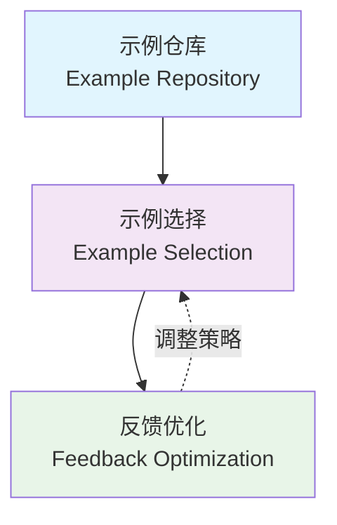
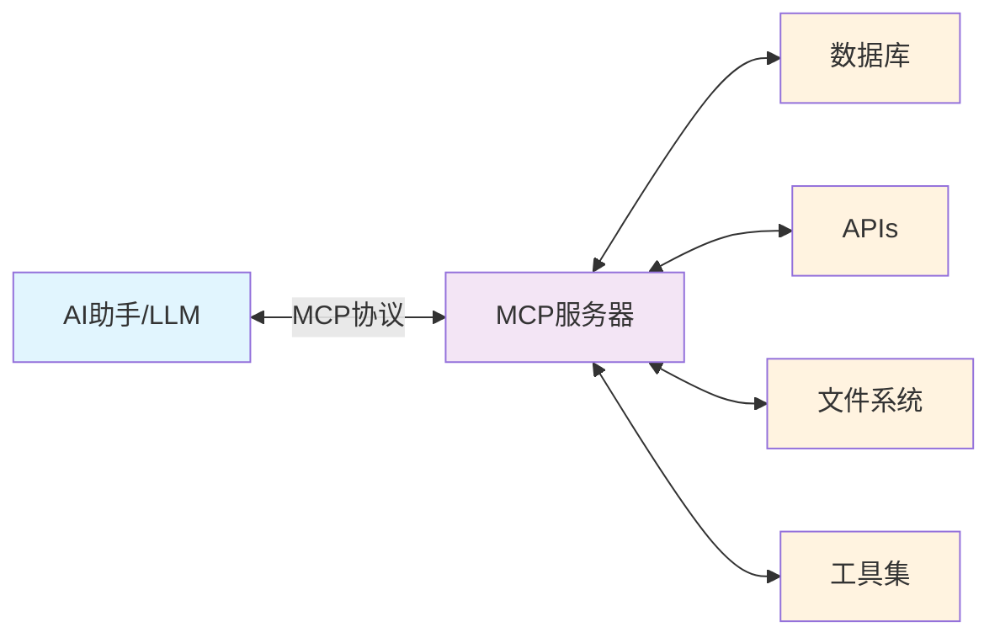

# 大模型高阶应用
## 关键技术


陈中普，通用人工智能与数字经济创新团队，2025

<div class="flex justify-center items-center h-60px mt-8px">
    
</div>

---

# 关于我：陈中普

- <flat-color-icons-department /> 西南财经大学，计算机与人工智能学院
- <flat-color-icons-serial-tasks /> 数据库系统、大模型应用
- 邮箱：zpchen@swufe.edu.cn
- 主页： https://zhongpu.info


<div grid="~ cols-2">

  <div class="flex justify-center items-center h-380px">
    
  </div>

  <div class="flex justify-center items-center h-380px">
    
  </div>

</div>

---

# 汇报提纲

### <span class="text-red">模块一、大模型检索增强生成（RAG）</span>
### 模块二、大模型认知框架
### 模块三、大模型使用工具

https://nlp-book.swufenlp.group/llm/

  <div class="flex justify-center items-center h-340px">
    
  </div>

---

# 模块一： 大模型检索增强生成（RAG）


  <div class="flex justify-center items-center h-300px">
    
  </div>

> 检索增强生成（Retrieval-Augmented Generation, RAG）是一种人工智能框架，它结合了传统信息检索系统（如搜索引擎和数据库）的优势与生成式大型语言模型（LLM）的能力。

---

## 1.1 为什么需要RAG？

> 模型可以理解成一个函数，经过预训练和后训练的模型知识是静态的，被蕴含在固定的参数中，常常被称为“参数”知识（Parametric Knowledge）。

### <flat-color-icons-bullish /> 生成式AI是个“函数”

<div grid="~ cols-2">

  <div class="flex justify-center items-center">

| $x_1$ | $x_2$ | $f(x_1, x_2)$ |
| ----- | ----- | ------------- |
| 1     | 2     | 5             |
| 2     | 3     | 13            |


  </div>

  <div class="flex justify-center items-center h-200px">


$$f(x_1, x_2) = x_1^2 + 5x_2 - 6$$


  </div>

</div>

<v-click>

而类似ChatGPT等高级模型有<span class="text-red">千亿</span>个参数。

  <div class="flex justify-center items-center h-120px">
  
  </div>

</v-click>

---

### <flat-color-icons-delete-database /> 大模型的局限性 

- **知识更新滞后**：模型的知识截止到训练数据的时间点，无法获取最新信息。
- **知识覆盖有限**：模型的知识面受限于训练数据，无法涵盖所有领域的最新信息。
- **生成内容的准确性**：模型生成的内容可能不准确或不可靠，尤其是在专业领域。
- **处理复杂查询的能力**：模型可能无法处理复杂的查询或需要多步推理的问题。

<div class="flex justify-center items-center h-260px">
  
</div>

这被称为大模型的<span class="text-red">“知识截断时间”</span>（knowledge cut-off date）。

---

### <flat-color-icons-collect /> RAG可以解决上述问题

<div class="flex justify-center items-center h-220px">
  
</div>

https://cloud.google.com/use-cases/retrieval-augmented-generation

> 检索增强生成（Retrieval-Augmented Generation, RAG）是一种人工智能框架，它结合了传统信息检索系统（如搜索引擎和数据库）的优势与生成式大型语言模型（LLM）的能力。

<v-click>
<div class="flex justify-center items-center h-140px">
  
</div>
</v-click>

---

### <flat-color-icons-biotech /> RAG的工作原理

<div class="flex justify-center items-center h-220px">
  
</div>

<v-click>

根据知识源的不同，RAG可以分为两大类：

- 经典RAG（主要是非结构化文档）
- 广义RAG（来自数据库、互联网和知识图谱等）

</v-click>

---

## 1.2 经典检索增强生成

尽管可以通过关键词匹配的方式检索文档，但目前主流的方式是通过<span class="text-red">向量的语义检索</span>。

<div class="flex justify-center items-center h-220px">
  
</div>

<v-click>

若干关键问题：

- 为什么需要向量化及如何向量化？
- 如何存储？
- 如何检索？

</v-click>

---

### 1.2.1 为什么需要向量化？

传统的基于词频等技术的文本检索技术难以处理语义相似性，比如尽管“京东”和“北京”尽管有相同的汉字，但是它和“淘宝”在语义上更加相似。

> In physics, as well as mathematics, a vector is often identified with a tuple of components, or <span class="text-red">list of numbers</span>, ...

为了解决这个问题，目前主流的方式是将文本转换为向量，这个过程也称<span class="text-red">嵌入（Embedding）</span>。

<v-click>
<div class="flex justify-center items-center h-220px">
  
</div>
</v-click>

---

### <flat-color-icons-heat-map /> 例子：文字的嵌入表示

比如“西南财经大学”经过OpenAI的 `text-embedding-3-small` 编码后，会变成一个长度为1536的向量：

$$[-0.034270092844963074, -0.01136163529008627, … ]$$

<div grid="~ cols-2">
    <div class="flex justify-center items-center h-240px">
    

</div>

<div>


> 二维示意图，讲话（talk）和讲座（lecture）更相近

<v-click>
当文本被编码为数百维甚至上千维的高维向量后，每个维度的数值通常不具备可解释的语义含义。然而，这些文本的语义关系及语言学规律可通过向量运算得到。
比如在向量上：

$$\text{国王} - \text{男人} + \text{女人} = \text{女王}$$

$$\text{中国} - \text{北京} + \text{巴黎} = \text{法国}$$


</v-click>

</div>

</div>


---

### <flat-color-icons-mind-map />  如何度量语义相似？

> 常用的距离度量包括点积、余弦相似度、欧式距离等。

| 文本   | 向量                                             |
|--------|--------------------------------------------------|
| 计算机 | [0.01357127912342548, 0.010388375259935856, …]    |
| 电脑   | [0.00580993015319109, 0.007956036366522312, …]    |
| 教师   | [0.00580993015319109, 0.007956036366522312, …]    |

<div class="flex justify-center items-center h-220px">
  
</div>

---

### <flat-color-icons-org-unit /> 如何选择嵌入模型？

<div grid="~ cols-2">

<div>

> 主流的嵌入模型都是通过大量文本预训练得到。不同的嵌入模型有其适用场景（领域、语言、速度、成本、维度、距离度量等），需要结合实际情况综合选择。

| 模型名称                | 维度  | 类型 |
|-------------------------|-------|------|
| GloVe                   | 100   | 开源 |
| FastText                | 300   | 开源 |
| all-MiniLM-L6-v2        | 384   | 开源 |
| text-embedding-3-small  | 1536  | 闭源 |
| voyage-3                | 1024  | 闭源 |

</div>

<div class="flex justify-center items-center">
  
</div>

</div>


---

### 1.2.2 如何存储？

面对非结构化文档（PDF、WORD等），直接嵌入不具备可行性：

- 超过嵌入模型的上下文长度
- 影响检索质量

<v-click>

<div class="flex justify-center items-center h-220px">
  
</div>

> 构建RAG知识库需要采用分块（Chunk）策略。

</v-click>

---

### <flat-color-icons-candle-sticks /> 分块策略：固定大小分块

按照预设的字符数将文档进行机械切割。

- 优点：快速
- 缺点：忽略文档结构、语义
- 适用场景：对精度不高、计算资源有限

为了保持语义连贯性，常见的做法是设置一个<span class="text-red">重叠区长度</span>（overlap）。


<div class="flex justify-center items-center h-220px">
  
</div>


---

### <flat-color-icons-conference-call /> 例子

<div class="flex justify-center items-center h-200px">
  
</div>

问题：年假是否需要提前申请？


| 编号 | 内容 |
|----------|----------|
| 1        | 员工年假根据工龄计算：入职1年以上享有5天年假，3年以上10天，5年以上15天。年假须提前7天申请 |
| 2        | 特殊情况（如医疗急需）可经主管批准后补申请... |


---

### <flat-color-icons-candle-sticks /> 分块策略：语义分块

语义分块通过分析文本结构和语义关系进行智能切割，通常基于自然语言处理技术。

<div class="flex justify-center items-center h-220px">
  
</div>


---

### <flat-color-icons-candle-sticks /> 分块策略：递归分块

递归分块通过分层迭代的分隔符优先级机制改进固定分块的缺陷， 其核心流程是按照分隔符优先级序列逐级切割文本。若初始分隔后的块仍超过设定长度，则递归调用下一级分隔符继续分块。

<div class="flex justify-center items-center h-220px">
  
</div>

---

### <flat-color-icons-candle-sticks /> 分块策略：基于文档结构

基于文档结构的分块是指针对特定文件类型设计专用分隔逻辑。比如 Markdown 文档可以按照标题层级分隔，而 HTML、XML 和 JSON 文档则按照标签分隔。

<div class="flex justify-center items-center h-240px">
  
</div>

---

### <flat-color-icons-candle-sticks /> 分块策略：案例

女娲智能体平台的分块（分段）设置

<div class="flex justify-center items-center h-240px">
  
</div>

<div class="flex justify-center items-center h-160px">
  
</div>


---

### <flat-color-icons-data-sheet /> 如何存储：向量数据库

<div class="flex justify-center items-center h-280px">
  
</div>

---

### 1.2.3 如何搜索？

<div class="flex justify-center items-center h-280px">
  
</div>

K近邻的暴力检索的方式难以有效扩展，特别是面对 10 亿级别的大规模向量数据时。因此，需构建<span class="text-red">高维向量索引</span>结构，通过近似 k 近邻查询算法平衡效率与精度。

---
layout: image-right
image: dict.jpg 
---

### <flat-color-icons-bar-chart /> 索引的基本概念及示例

索引的基本思想是：“以空间换时间”。


<div class="flex justify-center items-center h-300px">

  
</div>


---

### <flat-color-icons-bar-chart /> 高维索引：IVFFlat

IVFFlat（Inverted File with Flat quantization）是一种用于大规模向量相似性搜索的索引方法，其核心思想是将向量数据分成多个小块（或簇）。

<div class="flex justify-center items-center h-300px">
  
</div>

---

### <flat-color-icons-bar-chart /> 重排

RAG的常见思路是开始返回更多的top-k（确保召回率）；考虑到上下文的限制，应该进行<span class="text-red">重排</span>（Rerank）。

<div class="flex justify-center items-center h-280px">
  
</div>

---

### 1.2.4 RAG总结

<div class="flex justify-center items-center h-200px">
  
</div>

```python
def build_context(retrieved_docs, query):
    context = "\n".join(retrieved_docs)
    
    prompt = f"""
    基于以下上下文信息回答问题：
    
    上下文：
    {context}
    
    问题：{query}
    
    回答：
    """
    return prompt
```

---

## 1.3 广义检索增强生成

广义RAG是指从<span class="text-red">数据库、互联网和知识图谱</span>等结构化或半结构化数据源中检索信息，并将其与生成式模型结合。

### 1.3.1 基于联网检索的RAG

<div grid="~ cols-2 gap-4">

<div class="flex justify-center items-center h-240px">
  
</div>

<div class="flex justify-center items-center h-240px">
  
</div>

</div>

> 强调：大模型本身不具备联网能力，联网检索的RAG需要通过API调用外部搜索引擎（如Google、Bing等）来获取最新信息。

---

### <flat-color-icons-globe /> Cherry Studio中的联网检索

<div class="flex justify-center items-center h-240px">
  
</div>

<div class="flex justify-center items-center h-180px">
  
</div>

---
layout: two-cols-header
---

### <flat-color-icons-globe /> Deep Search/Deep Research

基于联网检索的RAG扩展形式为Deep Search和Deep Research，基于“搜索-阅读-推理”提升检索质量。

::left::

<div class="flex justify-center items-center h-180px">
  
</div>

> DeepSearch&DeepResearch可以看成是基于联网RAG的智能体，是最前沿的大模型应用之一。

::right::

<div style="font-size: 0.8em;">

| 发布时间   | 公司         | 产品                       | 类型   |
|------------|--------------|----------------------------|--------|
| 2025-02-01 | LangChain    | Ollama+OpenSearch          | 开源   |
| 2025-02-02 | OpenAI       | ChatGPT+DeepResearch       | 私有   |
| 2025-02-04 | Hugging Face | Open DeepResearch          | 开源   |
| 2025-02-15 | Perplexity   | DeepResearch               | 私有   |
| 2025-02-17 | X AI         | Grok3+DeepSearch           | 私有   |
| 2025-02-22 | 百度         | 百度搜索 +DeepSeek R1      | 私有   |
| 2025-02-23 | 腾讯         | 微信搜索 +DeepSeek R1      | 私有   |

</div>
---

### <flat-color-icons-globe /> Deep Search/Deep Research案例

<div class="flex justify-center items-center h-300px">
  
</div>

---

### 1.3.2 基于关系数据库的RAG

关系型数据库是当今信息系统的基石，常见的关系型数据库有 MySQL、PostgreSQL、Oracle 和 SQL Server 等。

| ID  | 姓名 | 学院   |
|-----|------|--------|
| 101 | 张三 | 计算机 |
| 102 | 李四 | 金融   |
| 103 | 王五 | 统计   |

关系数据库的查询语言是SQL（Structured Query Language），它是一种用于管理关系型数据库的标准语言。

```sql
SELECT 姓名, 学院 
FROM 学生 
WHERE ID = 101;
```

---

### <flat-color-icons-news /> Text2SQL

Text2SQL是指将自然语言查询转换为SQL查询的技术。它可以帮助用户通过自然语言与数据库进行交互，而无需了解SQL语法。

<div class="flex justify-center items-center h-280px">
  
</div>

---

### 1.3.3 基于知识图谱的RAG

知识图谱（Knowledge Graph）是一种结构化知识的表示形式，它将现实世界中的实体及其关系以图的形式进行建模。简单来说，知识图谱是一组三元组形式的事实集合，每个三元组通常表示为 (实体1, 关系, 实体2) 。

<div class="flex justify-center items-center h-280px">
  
</div>

---

# 汇报提纲

### 模块一、大模型检索增强生成（RAG）
### <span class="text-red">模块二、大模型认知框架</span>
### 模块三、大模型使用工具

https://nlp-book.swufenlp.group/llm/

  <div class="flex justify-center items-center h-340px">
    
  </div>

---

# 模块二：大模型认知框架

> 认知框架 (Cognitive Architecture)是智能系统用来组织和理解信息的基
本结构和模式。认知框架借鉴人类思维模式，通过提示工程技术构建具有人类
水平的通用人工智能系统，是目前通用人工智能研究的重要方向。

<div class="flex justify-center">

## 让大模型学习人的思考方式
</div>

<v-click>

- 情景学习
- 思维链
- 自我一致性
- ReAct框架
- 反思

  <div class="flex justify-center items-center h-180px">
    
  </div>

</v-click>

---

## 2.1 情景学习

情景学习（In-Context Learning）大模型能够借助提示中的示例理解任务需求，深入理解用户意图，并完成训练数据中未出现的特定任务，从而生成更精准且稳定的回答，也称称为少样本（Few-Shot）提示。


<div class="flex justify-center items-center h-360px">
    
</div>

---

### <flat-color-icons-faq /> 情景学习应用案例

考虑一个智能客服系统：

<div grid="~ cols-2 gap-4">

<div class="flex justify-center items-center">
    
</div>

<div class="flex justify-center items-center">
    
</div>

</div>

---

### <flat-color-icons-link /> 情景学习认知框架

<div grid="~ cols-2">

<div>


</div>

<div>
核心模块是示例选择，在选择示例时，一般我们需要确保示例要有四个主要特征：代表性、清晰性与简洁性、多样性以及相关性。


>  One study found that adding too much prompt context or too many examples worsened O1’s performance, essentially overwhelming its reasoning process​. Tip: For complex tasks, start with a zero-shot prompt (just the task description) and only add more instruction if you find the output isn’t meeting your needs. Often, minimal prompts yield the best results with these reasoning models​.

</div>

</div>

---

## 2.2 思维链

思维链（Chain-of-Thought，CoT）是通过将复杂问题分解为子问题并逐步推理来解决难题的方法，通过展示推理过程以增强理解。

<div class="flex justify-center items-center h-300px">
  
</div>

---

### <flat-color-icons-idea /> 思维链案例

<div class="flex justify-center items-center h-300px">
  
</div>

此外，研究还发现，仅仅添加一句<span v-mark.red>Let's think step by step</span>，模型的正确率就会大幅提升。这被称为<span class="text-red">零样本思维链（Zero-shot Chain-of-Thought）</span>。

> 再次强调：对应先进的推理模型，一般不需要再添加用于推理的示例和步骤。

---

### <flat-color-icons-idea /> 思维链的扩展

<div class="flex justify-center items-center h-300px">
  
</div>

比如，思维树的核心理念在于将思维过程视为一个动态的树状结构，每个节点代表一个思维步骤，而边则表示思维之间的逻辑关系。通过这种方式，模型不仅能够生成解决方案，还能在生成过程中进行自我评估和调整。

> 再次强调：对应先进的推理模型，一般不需要再添加用于推理的示例和步骤。

---

## 2.3 自我一致性

自我一致性（Self-Consistency）是指通过多次生成答案并选择最常见的答案来提高模型的稳定性和准确性。

<div class="flex justify-center items-center h-300px">
  
</div>

https://arxiv.org/pdf/2203.11171

---

## 2.4 ReAct框架

ReAct 框架打破了推理与行动之间的严格界限，模拟了人类<span class="text-red ">边思考边行动</span>的动态过程。 ReAct 框架允许系统在推理过程中动态地与环境交互，从而更灵活、高效地完成任务。

<div class="flex justify-center items-center h-260px">
  
</div>

https://arxiv.org/pdf/2210.03629


---

## 2.5 反思

反思（Reflexion）框架模仿了人类<span class="text-red">“吸取教训、总结经验”</span>的学习过程。人类在经历失败后会反思原因，这个框架让大语言模型通过语言化的自我反思来提升能力。

<div class="flex justify-center items-center h-260px">
  
</div>

https://arxiv.org/pdf/2303.11366

---

# 汇报提纲

### 模块一、大模型检索增强生成（RAG）
### 模块二、大模型认知框架
### <span class="text-red">模块三、大模型使用工具</span>

https://nlp-book.swufenlp.group/llm/

  <div class="flex justify-center items-center h-340px">
    
  </div>

---

# 模块三：大模型使用工具

> 工具使用（Tool Use）是指大模型在回答问题时，能够调用外部工具（如API、数据库等）来获取信息或执行操作，从而增强其能力。

<div class="flex justify-center items-center h-260px">
  
</div>

<div class="flex justify-center">

## 大部分人类学家相信工具的使用是人类进化史上重要的一步
</div>

---

## 3.1 工具使用的必要性

大模型通过调用外部工具，突破单一任务局限性，结合各领域专业工具，有效地与各种工具交互以完成复杂任务的过程。例如，复杂计算时大模型调用计算器工具、回答天气时大模型调用天气api、编写代码时大模型调用解释器…

<div grid="~ cols-2 gap-4">
    <div class="flex justify-center items-center">
  
</div>

<div class="flex justify-center items-center">
  
</div>
</div>

---

### <flat-color-icons-support /> 关键能力：选择工具

  <div class="flex justify-center items-center h-120px">
  
  </div>

假设有下面的工具：$f1(x)$、$f2(x)$、$f3(x)$、$f4(x, y)$，大模型需要根据输入的上下文信息和任务需求，选择合适的工具进行调用。

  <div class="flex justify-center items-center h-240px">
  
  </div>

---

## 3.2 基于协议的工具使用：MCP

MCP (Model Context Protocol) 是由 Anthropic 开发的一个开放标准协议，用于在AI助手和外部工具/数据源之间建立安全、标准化的连接。



---

### Cherry Studio安装MCP


  <div class="flex justify-center items-center h-240px">
  
  </div>

---

### Cherry Studio使用MCP

<div class="flex justify-center items-center h-360px">
  
</div>

---

## 3.3 基于视觉的工具使用

通过结合大模型与多模态视觉语言模型，对图形用户界面（如按钮、菜单、输入框等）进行感知和理解，然后根据用户自然语言指令需求生成操作序列，进而完成鼠标点击、键盘输入、拖拽等操作。

<div class="flex justify-center items-center h-360px">
  
</div>

---

# 总结：大模型高阶应用——关键技术

### 模块一、大模型检索增强生成（RAG）
### 模块二、大模型认知框架
### 模块三、大模型使用工具

https://nlp-book.swufenlp.group/llm/

  <div class="flex justify-center items-center h-340px">
    
  </div>

---
layout: end
---
# 谢谢聆听